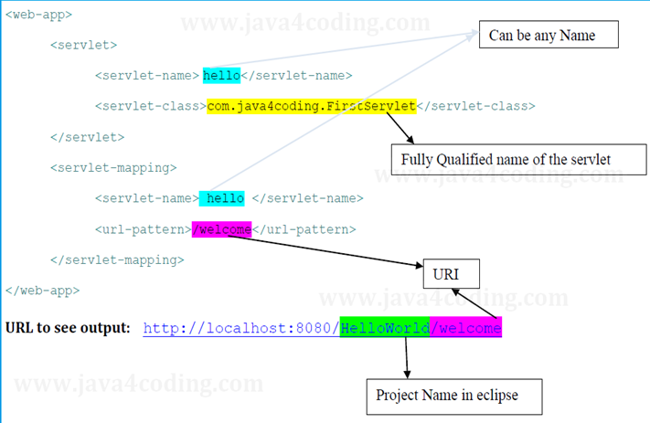
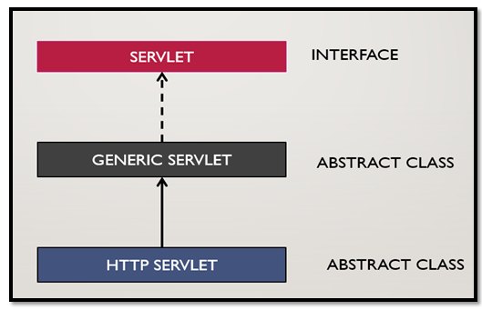
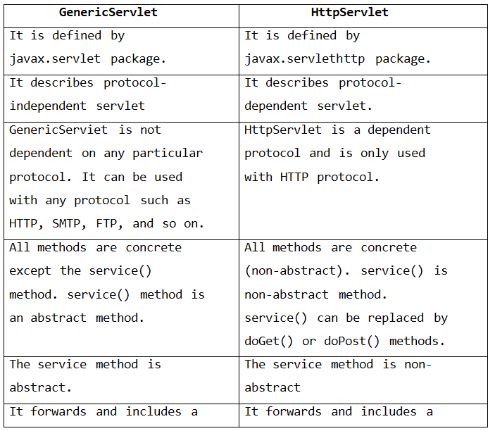
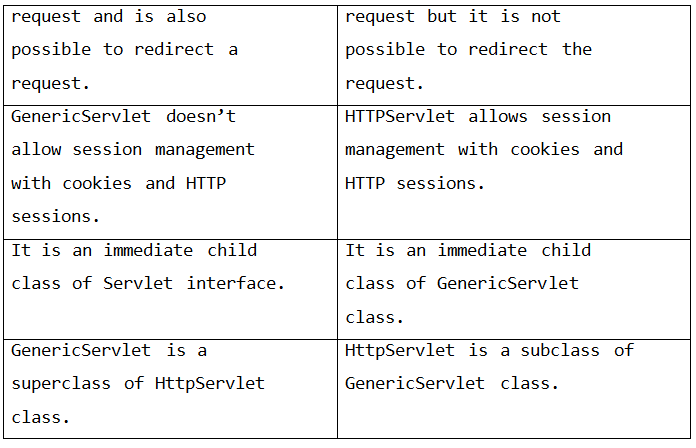
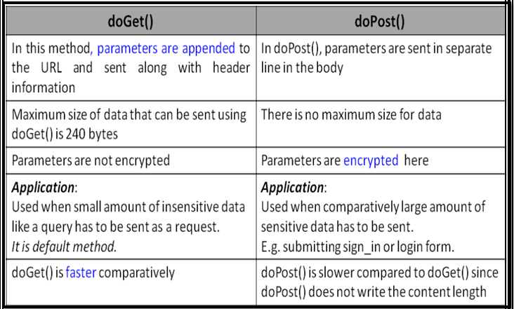
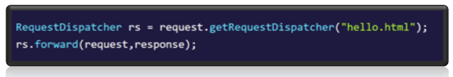
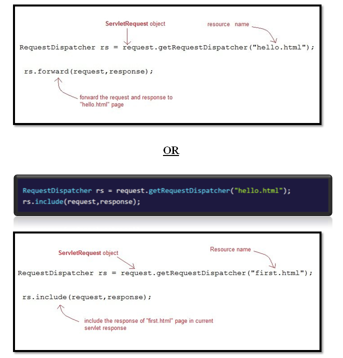
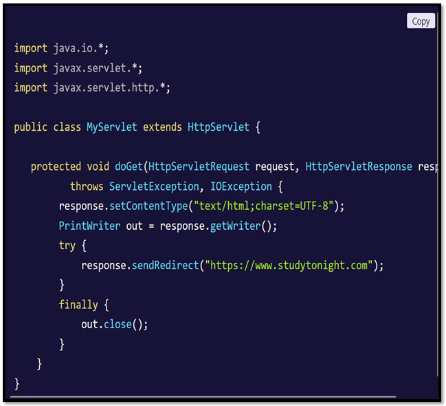
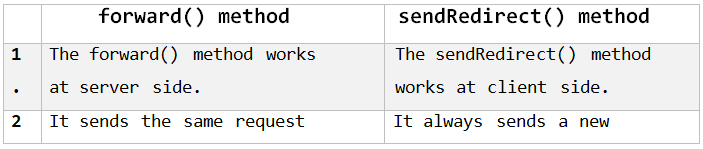
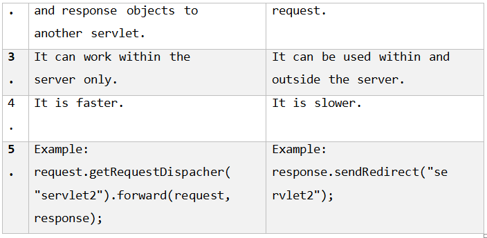

# Servlet-

## Application-

An application is a *set of program written to perform a specific task*.

An application is a *computer program designed to carry out a specific task, typically to be used by end-users*.
For example= Web browsers,word processors , games and utilities are all applications.

The word "application" is used because *each program has a specific application for the user*.

### Types od Application-

1. Standalone Application
2. Client Server Application
3. Web Application
4. Hybrid and Native application.

#### 1. Standalone Application=

A Standalone application is a software program designed in such a way that to run this software program, users don't need an internet connection or any server access.

#### 2. Client Server Application=

A client-server application is a program that runs on the client-side while accessing the information over a remote server.

#### 3. Web Application=

Web application is an application which is stored inside the server, can be accessed through the internet over the browser.

Any application  that is stored on a remote server and delivered over the Internet through a browser interface.

Web applications donot need to be downloaded since they are accessed through a network. Users can access a Web application through a web browser such as Google Chrome, Mozilla Firefox or Safari.

For a webapp to operate, it needs a Web server and a database.Web servers manage the requests that come from a client.A database can be used to store any needed information.

#### 4. Hybrid and Native application=

***Native Application=*** These are developed for specific platform or operating systems such as iOS or Android and are installed directly in the device.

***Hybrid Application=*** A hybrid application comibines the element of a native app (an application developed for a specific platform like Android or iOS) and web applications (an appliaction that can be accessed on internet through the browser). It is built in a way that allows dedvelopers to use the same code for all the operating systems.

***Server=*** A server is a computer program which provides service to application and its user (called as client).

## Web Pages-

A web page is a document on the web that is a accessed in a web browser through the internet.

### Types of web page-

There are mainly 2 types of webpages based on functionality:

1. Static webpage
2. Dynamic webpage

#### 1. Static webpages=

Static webpages are the webpages that are already stored in the server.

#### 2. Dynamic Webpages=

Dynamic webpages are the webpage that are generated during the euntime inside the server.

In java we can generate dynamic webpages using Servlets and JSP.

## Web Container-

* A web container is the component of the webserver that **interacts with the java servlets**.
* Web Container are responsible for managing execution of the servlets and JSP pages for Java EE application.
* Servlets don't have a main(). Web container manages the life cycyle of the Servlet instance.
* When a request comes from the servlet, the server hands the request to the web container.
* Webcontainer is responsible for instantiating the servlet or creating a new thread to handle the request.
* It's the job of the web container yo get the request and response to the servlet.
* The container creates multiple threads to process multiple requests to a single server.

## Difference between web server and application server-

1. **Web server** encompasses *web containers only* whereas **Application server** encompasses *web container as well as EJB container*.
2. **Web server** is useful or fitted for *staic content* but **application server** is fitted for *dynamic content*.
3. **Web server** utilizes *less resource*  whereas **Application sever** utilizes comparatively *more resources*.
4. **Web server** arranges the run environment for *web applications*. While **Application Server** arranges the run environment for *enterprises applications*.
5. *Multithreading* is supported in **web server**, but it is *not supported* in **Application server**
6. **Web server** capacity is *lower* than **application server**.

## What is deployment Descriptor -web.xml file

* A deployment tool is used to **map the HTTP request with the servles**.
* When the web server recieves a request for the application, it uses the deploy descriptor to **map the URL of the request to the code that ought to handel the request.**
* The deployment descriptor should be named as **web.xml**.
* It resides in the application's WAR file under the **WEB-INF/ directory**.

## Description of the elements of the web.xml file-

There are too many elements in the web.xml file. Here the illustration of some elements that is used in the above web.xml file. The elements are as follows:

* `<web-app>` represents the *whole application*.
* `<servlet>` is sub element of `<web-app>` and *represents the servlet*.
* `<servlet-name>` is sub-element of `<servlet>` represents the *name of servlet*.
* `<servlet-class>` is sub-element of `<servlet>` represents the *class of servlet*.
* `<servlet-mapping>` is sub element of `<web-app>`. It is used to *map the servlet.*
* `<url-pattern>` is a sub element of `<servlet-mapping>`. This pattern is used at client side to *invoke the servlet*.
* Root element of web.xml should be `<web-app>`. `<servlet>` element map a URL to a servlet using `<servlet-mapping>` element.
* To map a URL to a servlet, you declare the servlet with the `<servlet>` element, then define a mapping from a URL path to a servlet declaration with the `<servlet-mapping>` element.
* The `<servlet>` element declares the servlet class and a logical name used to refer to the servlet by other elements in the file.
* You can declare multiple servlets using the same class but name for each servlet must be unique across the deployment descriptor.
* The `<servlet-mapping>` element specifies a URL pattern and the name of a declared servlet to use for requests whose URL matches the pattern.
* The URL pattern can use an asterisk (*) at the beginning or end of the pattern to indicate zero or more of any character.
* The standard does not support wildcards in the middle of a string, and does not allow multiple wildcards in one pattern.
* The pattern matches the full path of the URL, starting with and including the forward slash (/) following the domain name. The URL path cannot start with a period (.).



## Java Servlet

* A Servlet is a *server side component* which is used to build *dynamic web page*.
* Servlet is an **API that provides many interfaces and classes including documentation**.
* Servlet is an **interface that must be implemented for creating any Servlet**.
* Servlet is a **class that extends the capabilities of the servers and responds to the incoming requests**. It can respond to any requests.

## Lifecycle of Servlet

A servlet life cycle can be defined as **the entire process from its creation till the destruction**.

1. Load the Servlet class
2. Instantiate the servlet
3. Invoke init-method
4. Invoke Service-method
5. Destroy method is invoked

### 1. Servlet Class is loaded

* The class loader is responsible to load the servlet class.
* The servlet class is loaded when the first request for the servlet is recieved by the web container.

### 2. Servlet instance is created

* The web container creates the instance of a servlet after loading the servlet class.
* The servlet instance is created only once in the servlet life cycle.

### 3. init method is invoked

* The web container calls the init method only once after creating the servlet instance.
* The init method is used to initialize the servlet.
* It is method in `java.servlet.Servlet` interface.
* The syntax of `init()` is:

```
public void init(ServletConfig config) throws ServletException
```

### 4. service method is invoked

* The web container calls the service method each time when request for servlet is received.
* The `service()` will then call the `doGet()` or `doPost()` based on the type of HTTP request.
* The syntax of the `service()` of the Servlet interface is:

```
public void service(ServletRequest request, ServletResponse response) throws ServletException, IOException
```

### 5. destroy() is invoked

* The web container calls the `destroy()` before removing the servlet instance from the service.
* It gives the servlet an opportunity to cleann up any resource for example memory, thread, etc.
* The syntax of the `destroy()` of the servlet interfaceis given below:

```
public void destroy()
```

## Ways of Creating a Servlet

1. Implementing Servlet Interface
2. Extending Generic Servlet.
3. Extending HTTP Servlet.



## Servlet Interface

* Servlet is an *interface in* `java.servlet` package.
* We can create a Servlet by *implementing the Servlet interface and providing the implementation for all the methods*.
* It has **5 abstract methods:**

1. `init()`
2. `service()`
3. `destroy()`
4. `getServletinfo()`
5. `getServletConfig()`

* The methods and their description:

1. `public void init(ServletConfig config)`=
    initialize the servlet. It is the lifecycle method of servlet and invoked by the web container only once.
2. `public void service(ServletRequest request, ServletResponse response)`=
    provides response for incoming request. It is invoked at each request by the web container.
3. `public void destroy()`=
    it is invoked once and indicates the servlet is being destroyed.
4. `public ServletConfiggetServletConfig()`=
    returns the object of ServletConfig.
5. `public String getServletInfo()`=
    returns information about servlet such as wrter, copyright, version,etc.

## Generic Servlet

* It is an **abstract class** in `javax.servlet` package.
* `GenericServlet` implements `Servlet`,`ServletConfig` and `Serializable` interface.
* It provides the implementation of all the method of these interfaces excepth the `service()`.
* `GenericServlet` class can handel any type of request so it is **protocol independent**.
* We can create a generic servlet by inheriting the `GeneicServlet` class and providing the implementation of the `service()`.

### Disadvantages of the Generic servlet

1. Working with Generic servlet is not that easy because we don't have convinent method such as `doGet()`, `doPost()`, `doHead()`, etc in Generic Servlet that we can use in *HTTPServlet*.
2. In `HTTPServlet` we need to override partiular convenient methos for particular request, for example if you need to get the information then override `doGet()`, if we want to send information then override `doPost()`. However in Generic Servlet we only override `service()` for each type of request which is not convenient.
3. Therefore it is recommended to use the `HTTPServlet` instead of the `GenericServlet`.
4. `HTTPServlet` is easier to work with and has more methods to work with than `GenericServlet`.

## HTTPServlet Class

* It is an **abstract class** in `javax.servlet.http` package.
* The `HTTPServlet` class extends the `GenericServlet` class and implements `Serializable(I)`. It provides http specific methods such as `doGet()`, `doPost()`, `doHead()`, `doTrace()`, etc.
* It is an **abstract class with no abstract methods.**

### Methods of HTTPServlet class

1. `protected void doGet(HttpServletRequest req, HttpServletResponse resp)`:

    * This mehtod is called by servlet service method to handel the HTTP GET request from client.
    * When overriding this method, read the request data, write the response headers, get the response's writer or output stream object and finally write the response data.

2. `protected long getLastModified(HttpServleRequest req)` returns the time when `HttpServletRequest` was last modified since midninght Jan 1,1970 GMT.

3. `protected void doHead(HttpServletRequest req, HttpServletResponse resp)`:

    * this mehtod is called by servlet `service()` to handel the HTTP HEAD request from the client.
    * The client sends a HEAD request when it wants to see only the headers of a response, such as Content-Type or Content-Length.

4. `protected void doPost(HttpServletRequest req, HttpServletResponse resp)`:

    * This method is called by servlet `service()` to handel the `POST` request from the client.
    * The `HTTP POST()` allows the client to send data of **unlimited length** to the web server a single time and is useful when posting information to the server.
    * This method is used when we are **transfering information from client to the server**.

5. `protected void doPut(HttpServletRequest req, HttpServletResponse resp)`:

    * This method is called by `service()` to handel the PUT request from client.
    * this method **sends file to the server, this is similar to the FTP operations from client to server**.

6. `protected void doDelete(HttpServletRequest req, HttpServletResponse resp)`:

    * Called by servlet `service()` to *handle the DELETE request from client that allows a client to delete a document, webpage or information from the server*.

7. `protected void doOptions(HttpServletRequest req, HttpServletResponse resp)`:

    * Called by the `service()` to *allow a servlet to handel a OPTIONS request*.
    * The OPTIONS request determines which HTTP methods the server supports and returns an appropiate header.

8. `protected void doTrace(HttpServletRequest req, HttpServletResponse resp)`:

    * This method is called by `service()` for **handling TRACE request**.
    * used for **debugging purpose**.

9. `protected void service(HttpServletRequest req, HttpServletResponse resp)`:

    * There is **no need to override this method**, this method *receives the HTTP request from client and forwards them to the corresponding doXXX methods such as doGet(), doPost(), doHEAD() etc*.

10. `public void service(ServletRequest req, ServletResponse res)`:

    * *Forwards client request to the protected service method*.
    * There’s **no need to override this method** as well.

### Difference between GenericServlet and HttpServlet




### Difference between doGet() and doPost()



## RequestDispatcher -

* The RequestDispatcher is an Interface that comes under package javax.servlet.
* The RequestDispatcher interface provides the facility of dispatching the request from one resource to another resource it may be html, servlet or jsp.
* This interface can also be used to include the content of
one resource to another resource also.
* This interface has following two methods:
    1. forward()
    2. include()

1. `public void forward(ServletRequest request, ServletResponse response)`:

 It forwards the request from one servlet to another resource (such as servlet, JSP, HTML file).

2. `public void include(ServletRequest request, ServletResponse response)`:

 It includes the content of the resource(such as servlet, JSP, HTML file) in the response.

### How to get an Object of RequestDispatchcer-

`getRequestDispatcher()` of **ServletRequest** returns the object of **RequestDispatcher**.



### SendRedirect in Servlet-

* The `sendRedirect()` of HttpServletResponse interface ofjavax.servlet.httppackage can be used to redirect response to another resource, it may be servlet, jsp or html file.
* It accepts relative as well as absolute URL.


### Difference between `forward()` and `sendRedirect()`-




